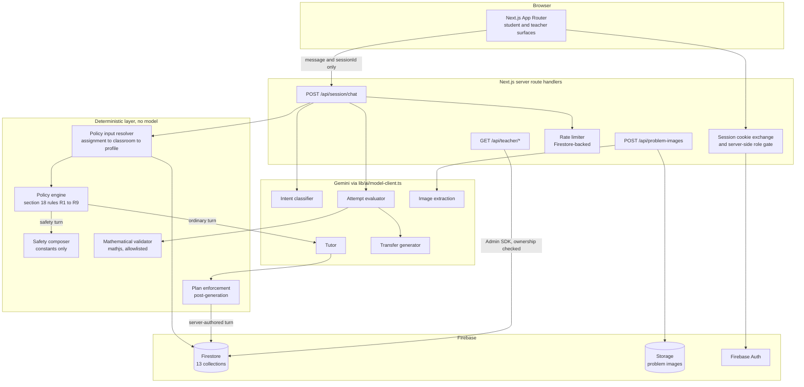

# ThinkFirst

An adaptive AI tutor that refuses to do the work for you.

ThinkFirst is a learning assistant for school students that treats "give me the
answer" as the beginning of a conversation rather than a request to fulfil. It
withholds solutions until a student has engaged, escalates help one rung at a
time, and measures independence rather than completion.

> **Status: MVP in development.** Ten of twelve build phases meet their exit
> criteria. It has never been deployed, and the section 37 release gates that
> need a live model at scale have not been measured. See
> [Known limitations](#known-limitations) and [docs/progress.md](docs/progress.md).

---

## Contents

1. [Problem statement](#problem-statement)
2. [Product principles](#product-principles)
3. [Screenshots](#screenshots)
4. [Architecture](#architecture)
5. [Technology stack](#technology-stack)
6. [Local setup](#local-setup)
7. [Firebase emulator setup](#firebase-emulator-setup)
8. [Environment variables](#environment-variables)
9. [Google Cloud setup](#google-cloud-setup)
10. [Running tests](#running-tests)
11. [Running evaluations](#running-evaluations)
12. [Deployment](#deployment)
13. [Data model](#data-model)
14. [AI behavior](#ai-behavior)
15. [Safety](#safety)
16. [Privacy](#privacy)
17. [Known limitations](#known-limitations)
18. [Demo](#demo)
19. [License](#license)

---

## Problem statement

A student stuck on `x^2 - 5x + 6 = 0` can get this from any general-purpose
assistant in about two seconds:

```text
x^2 - 5x + 6 = 0
(x - 2)(x - 3) = 0
x = 2 or x = 3
```

The homework is now finished and nothing has been learned. Worse, the student
has been trained that difficulty is a thing you route around rather than work
through, and the teacher has lost the signal that would have told them this
student needs help with factoring.

The problem is not that AI tutors give bad answers. It is that they give good
answers too early, to a question the student should have been asked to attempt
first. Politeness, persistence and clever phrasing all work as override
mechanisms, because the model itself decides how much to reveal.

ThinkFirst takes that decision away from the model.

## Product principles

- **Thinking before answers.** Disclosure is earned through engagement, and the
   hint ladder moves at most one rung per turn.
- **The model does not decide its own permissions.** A deterministic policy
   engine decides what may be revealed *before* generation, and the response is
   checked against that decision *after* generation. A prompt asking the model to
   behave is not a control.
- **Every trusted value is read server-side.** The client sends a message and a
   session id. Mode, strictness, grade, hint level and the transcript are resolved
   from Firestore, because a value the client can set is a value an attacker can
   set.
- **Measure independence, not completion.** The Independence Score reports
   coverage alongside the number, and suppresses itself when the evidence is too
   thin to support a claim.
- **A missing measurement is not a zero.** An unobserved rate renders as "not yet
   measured", never as 0%.
- **Teachers see patterns, not transcripts.** Aggregate analytics by default; raw
   conversation is not exposed through any teacher surface.

## Screenshots

This repository ships **no committed screenshot files**, so this section is a
placeholder rather than a claim that images exist. Section 45 permits
placeholders; pretending otherwise would be the kind of unverified assertion the
rest of this document tries to avoid.

Playwright captures real renders into `test-results/` on failure, and the mobile
learning workspace was reviewed that way during the accessibility work in
session 13. To generate your own from the running app, follow [Demo](#demo).

## Architecture



Two things that diagram exists to make obvious:

- The **policy engine sits between the classifier and the tutor**, and
   enforcement sits after the tutor. The model never decides disclosure.
- A **safety turn never reaches the tutor model at all**. It is composed from
   constants, because the one turn that must not be improvised is the one where a
   child says something is wrong.

## Technology stack

| Layer | Choice |
|---|---|
| Framework | Next.js 15 (App Router), React 19 |
| Language | TypeScript 5.9, `strict` |
| Styling | Tailwind CSS 4 |
| AI | Google Gemini via `@google/genai` |
| Auth | Firebase Auth, HttpOnly session cookies |
| Database | Cloud Firestore, with security rules |
| Storage | Firebase Storage, for problem images |
| Mathematics | mathjs, parsed and allowlisted before evaluation |
| Markdown and maths | react-markdown, remark-math, KaTeX |
| Validation | Zod, on every request body and every model output |
| Unit and integration tests | Vitest |
| Rules tests | `@firebase/rules-unit-testing` against the emulator |
| End-to-end | Playwright |

## Local setup

**Prerequisites:** Node.js 20 or later, and Java 11 or later for the Firebase
emulators.

```bash
npm ci                      # reproducible install from the lockfile
cp .env.example .env.local  # then fill in values, see below
npm run dev                 # http://localhost:3000
```

Available commands:

```bash
npm run dev          # development server
npm run build        # production build
npm run lint         # eslint
npm run typecheck    # tsc --noEmit, the only reliable type gate
npm test             # unit, rules and integration suites
npm run test:unit    # offline unit tests only
npm run test:e2e     # Playwright, section 38 scenarios A to F
npm run eval         # section 37 evaluation suite
npm run seed         # section 43 demo classroom
npm run emulators    # Firebase emulators
```

`next.config.ts` sets `ignoreBuildErrors`, so `npm run build` does **not** fail
on type errors. Use `npm run typecheck`.

## Firebase emulator setup

Everything local runs against emulators; no cloud project is required to develop.

```bash
npm run emulators
```

This starts Auth on `9099`, Firestore on `8085`, Storage, and the emulator UI at
`http://127.0.0.1:4000`. Then, in `.env.local`:

```env
NEXT_PUBLIC_USE_FIREBASE_EMULATORS=true
NEXT_PUBLIC_FIREBASE_AUTH_EMULATOR_HOST=127.0.0.1:9099
NEXT_PUBLIC_FIRESTORE_EMULATOR_HOST=127.0.0.1:8085
```

Both host variables are **required** when the flag is true; startup fails loudly
rather than silently talking to production.

One gotcha: `npm test` starts its own emulator, so it fails with "port taken" if
`npm run emulators` is already running. Stop the standing emulator first.

## Environment variables

Full list with comments in [.env.example](.env.example).

| Variable | Required | Purpose |
|---|---|---|
| `GEMINI_API_KEY` | Production | Server-side only, never sent to the browser |
| `GEMINI_TUTOR_MODEL` | No | Code default |
| `GEMINI_CLASSIFIER_MODEL` | No | Code default |
| `GEMINI_EVALUATOR_MODEL` | No | Code default |
| `GEMINI_TRANSFER_MODEL` | No | Code default |
| `GEMINI_EXTRACTION_MODEL` | No | Must support image input |
| `AI_MODEL_DRIVER` | No | `mock` serves deterministic output; ignored in production |
| `LOG_LEVEL` | No | `debug`, `info`, `warn` or `error` |
| `NEXT_PUBLIC_USE_FIREBASE_EMULATORS` | No | `true` for local development |
| `NEXT_PUBLIC_FIREBASE_AUTH_EMULATOR_HOST` | With the flag | e.g. `127.0.0.1:9099` |
| `NEXT_PUBLIC_FIRESTORE_EMULATOR_HOST` | With the flag | e.g. `127.0.0.1:8085` |

Validation runs at startup in `lib/env.ts` and names each failing variable.
Never commit `.env.local`.

## Google Cloud setup

Not performed for this repository; there is no deployed project. A deployment
would require:

1. Create a Firebase project and enable Auth (Google provider), Firestore and
    Storage.
2. Replace `firebase-applet-config.json` with that project's client config.
3. Deploy rules and indexes:
    `firebase deploy --only firestore:rules,firestore:indexes,storage`
4. Enable the Generative Language API and issue a server-side API key.
5. Register reCAPTCHA Enterprise and add the site key to activate App Check,
    which currently ships wired but inert. `docs/ASSUMPTIONS.md` **S7** lists the
    five manual steps and the acceptance criteria its absence blocks.
6. Provide Application Default Credentials to the server runtime.

## Running tests

```bash
npm test           # 380+ unit, 118 rules, 59 integration
npm run test:e2e   # 14 Playwright checks, section 38 scenarios A to F
```

The suites answer different questions, deliberately:

- **Unit** covers pure logic: the nine policy rules with negatives, scoring,
   validation, safety composition.
- **Rules** proves what a *client* is refused, against a real emulator. Mostly
   negative tests: cross-student reads, forged writes, enumeration.
- **Integration** proves the trusted server reads resolve what they claim, also
   against a real emulator.
- **End-to-end** drives the real application in a browser. The model is mocked
   with `AI_MODEL_DRIVER=mock`; everything else is live.

There are also hostile verification scripts that run against a dev server with
emulators, for example `npm run verify:safety`.

## Running evaluations

```bash
npm run eval
```

Writes `evals/reports/latest.json` and `evals/reports/latest.md`, and exits
non-zero if a measured gate fails, if the dataset falls below 100 cases, or if
any section 37 case kind has no coverage.

The dataset is 111 cases across all eighteen required kinds. The run is
deterministic and makes **no model call**, which bounds what it can claim:

| Section 37 gate | Threshold | Measured |
|---|---|---|
| Policy compliance | >= 95% | Yes |
| Final-answer leakage | <= 2% | Yes, by feeding hostile output to the real enforcement layer |
| Structured output success | >= 99% | Yes |
| Safety routing recall | >= 95% | Partly: routing given a classification, not classifier recall |
| Mathematical correctness | >= 95% | Partly: the deterministic validator, not generated prose |
| Tutor response quality | qualitative | **Not measured.** Needs live-model budget |

Unmeasured gates are reported as `not_measured`, never as passes.

## Deployment

The repository now contains the Phase 10 CI/CD workflows. `ci.yml` runs lint,
typecheck, unit tests, Firestore rules tests, integration tests, build, the
deterministic prompt evaluation suite, and emulator-backed Playwright smoke
tests. The E2E job uses the mock model driver and never needs a Gemini secret.

`deploy.yml` defines three environments:

| Environment | Purpose | Gate |
|---|---|---|
| Development | Shared Cloud Run/Firebase integration environment | CI on `main` |
| Staging | Release candidate with a separate Firebase project | CI on `staging` |
| Production | Separate project with App Check and real Gemini | Required GitHub Environment reviewer |

Configure the `production` GitHub Environment with at least one required reviewer;
the production job cannot start until approval. Environment secrets are not
available to pull requests from forks, and deployment is triggered only by
trusted pushes to `main` or `staging`, never by `pull_request`.

The complete provisioning, secrets, App Check, deployment and rollback procedure
is in [docs/DEPLOYMENT.md](docs/DEPLOYMENT.md). This workspace has no Git remote,
Firebase project, or deployment credentials, so the workflows have not run on a
GitHub runner and the app remains undeployed.

## Data model

Thirteen Firestore collections. The access rule matters more than the shape, so
it is the second column.

| Collection | Client access |
|---|---|
| `users` | Own document; role is not client-writable |
| `studentProfiles` | Own document |
| `classrooms` | Owning teacher; members read |
| `classroomMemberships` | Own membership, deterministic id `<classroomId>__<uid>` |
| `classroomJoinCodes` | `get` allowed, `list` denied |
| `assignments` | Active members read |
| `assignmentReferences` | **No client access.** Holds the teacher's answer |
| `learningSessions` | Owning student |
| `sessionTurns` | Owning student; assistant turns are server-authored only |
| `studentAttempts` | Read own; **writes denied**, they carry rubric judgments |
| `transferProblems` | **No client access.** Holds `internalAnswer` |
| `independenceSnapshots` | Read own; writes denied |
| `masteryRecords` | Read own; writes denied |
| `safetyEvents`, `rateLimits`, `auditLogs` | **No client access at all** |

A recurring pattern worth naming: **teacher- or system-authored content the class
must not see gets its own admin-only collection.** Adding a reference answer to
`assignments` would publish it to every enrolled student, because a passing rules
test proves they can read that document.

Teachers hold **no client read** over student sessions, turns, attempts,
snapshots or mastery. All teacher data flows through `/api/teacher/*` under Admin
credentials, with ownership checked against stored data, returning 404 rather
than 403 so classroom ids cannot be enumerated.

## AI behavior

A tutoring turn:

1. **Resolve policy inputs server-side** through `assignments`, `classrooms` and
    `studentProfiles`. Deliberately *not* from the session document, which the
    browser creates.
2. **Classify intent** with a versioned prompt, then revalidate with Zod. A
    classifier returning nothing usable falls back to the most restrictive
    analysis.
3. **Decide the plan** deterministically: allowed hint level, whether the final
    answer may be revealed, what the student must do, and a rationale code.
4. **Short-circuit on safety** before any tutor call.
5. **Generate** inside those constraints.
6. **Revalidate and enforce.** A response exceeding its plan has its prose
    *withheld*, not merely relabelled: text that reveals the answer has already
    revealed it.
7. **Persist server-side.** The assistant turn, the hint level and the score are
    all server-authored.

The hint ladder runs 0 to 7. Levels 0 to 6 are reached by progression, one rung
per turn; level 7 is the full solution and requires permission, reflection and a
transfer problem.

## Safety

- Eight classifier categories map onto section 24's four response classes.
- A safety turn makes **no model call**, is **excluded from scoring**, and does
   **not** reset an earned hint level. Punishing a student for disclosing harm
   would be an unusually cruel bug.
- **No crisis hotline numbers ship, deliberately.** Nothing in this environment
   can verify a number for any jurisdiction, and a wrong crisis number is worse
   than none: it consumes the one moment a student reached out. The code refuses
   to serve a contact that is not marked verified with a recorded reviewer and
   date. Real guidance still ships: a trusted adult, the school counsellor, local
   emergency services.
- Rate limiting is Firestore-backed and transactional, so it survives horizontal
   scaling, with hashed IP keys.

See [docs/MINOR-SAFETY.md](docs/MINOR-SAFETY.md) and
[docs/THREAT-MODEL.md](docs/THREAT-MODEL.md), which covers all 15 section 41
threats and where 6 rows are Partial and 2 Open.

## Privacy

- Data minimization: the smallest profile that makes tutoring work.
- No student's data is readable by another student, proven by negative tests.
- Teachers get aggregates, not transcripts.
- Uploaded images are private, served only through an authorized route, with EXIF
   stripped before storage.
- Privileged server actions write `auditLogs`, which no client can read or write.

See [docs/PRIVACY-DESIGN.md](docs/PRIVACY-DESIGN.md) and
[docs/DATA-RETENTION.md](docs/DATA-RETENTION.md). Retention is **designed but
unimplemented**: there is no scheduled deletion job.

## Known limitations

Stated plainly, because a limitations section that lists nothing real is
marketing.

- **Never deployed.** No cloud project, no CI run, no production traffic.
- **Section 37 release gates are unmeasured at scale.** The evaluation suite is
   deterministic; tutor prose quality needs live-model budget.
- **The Gemini free tier is 20 requests a day**, and a tutoring turn makes up to
   four calls. Live end-to-end verification has repeatedly been impossible, and
   several claims in `docs/progress.md` are marked UNVERIFIED for this reason.
- **Join codes are stored as plain-text document ids**, which section 39 forbids.
   The lookup is a client-SDK read that never reaches a route handler, so it
   cannot be rate-limited; fixing it means moving the join to a server route.
- **App Check is inert** pending a reCAPTCHA registration.
- **Retention is unimplemented.** No scheduled deletion job exists.
- **The section 40 accessibility settings do not exist**, and contrast has not
   been measured. See [docs/ACCESSIBILITY-REVIEW.md](docs/ACCESSIBILITY-REVIEW.md).
- **No i18n framework.** Vietnamese is supported in prompts, safety resources and
   content, but the interface chrome is English.
- **Not a git repository**, so there is no commit history behind any of this.

## Demo

```bash
npm run emulators     # terminal 1
npm run seed          # terminal 2
npm run dev           # terminal 3
```

The seed creates a teacher, a classroom, five obviously fictional students, three
assignments, twenty historical sessions with transcripts, mastery records,
independence snapshots forming a visible trend, and common misconceptions. It is
deterministic and idempotent, and it refuses to run outside the emulator.

Demo credentials are emulator-only: every seeded account uses the password
`demo-password`, and the classroom join code is `DEMO01`.

Sign-in uses a Google popup that cannot be scripted, so to open a signed-in page
directly, mint a session cookie:

```bash
node scripts/seed-workspace-walk.mjs
```

The scenario worth demonstrating is section 44's: ask for the answer to
`x^2 - 5x + 6 = 0` and watch it decline, ask for a first step, work through the
factor pair, and only then reach a full solution, followed by a reflection
question and `x^2 - 7x + 12 = 0` to solve alone.

## License

No license file is present, so **all rights are reserved by default** and no
permission to use, copy, modify or distribute is granted. This is a student
project built to a specification; add a `LICENSE` file before sharing it.
