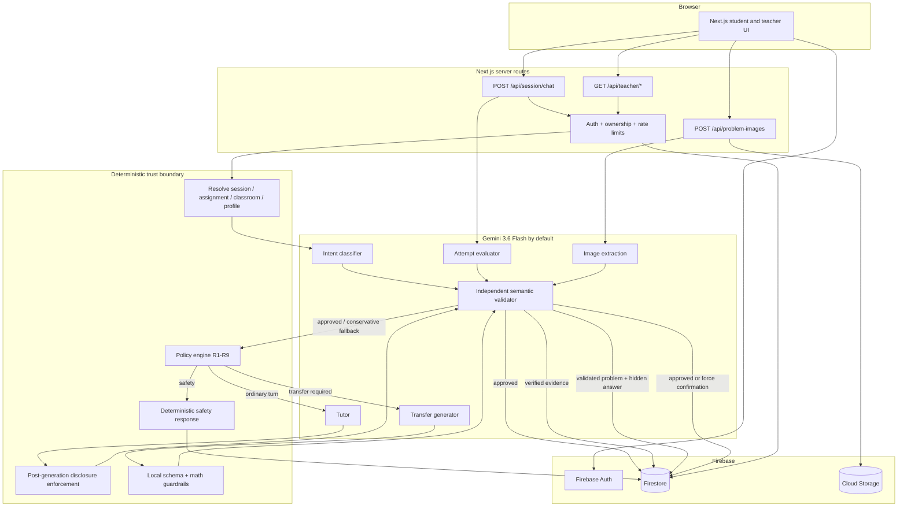

# ThinkFirst

An adaptive AI tutor that makes the student think before it reveals the answer.

ThinkFirst is a Next.js/Firebase tutoring application for school students. The model does not decide its own permissions: a deterministic server-side policy engine decides what may be revealed, while Gemini handles educational reasoning and independent semantic verification.

> **Status: MVP under active development.** The application has been exercised on Firebase/Google Cloud Run, but release-quality live-model evaluation gates are not yet fully measured. See [`docs/progress.md`](docs/progress.md) and [`docs/logs/`](docs/logs/) for the evidence ledger.

## Product principles

- **Thinking before answers.** Help escalates through a hint ladder instead of jumping directly to a solution.
- **Policy is deterministic.** Gemini never decides role, ownership, strictness, hint ceilings, or whether a final answer may be revealed.
- **Important AI output is verified.** For now, load-bearing semantic decisions use a second Gemini validation pass. Local deterministic checks remain as security/structure guardrails and as a future cost-optimization path.
- **Missing evidence is not failure.** If evaluation or verification is unavailable, coverage falls instead of silently scoring the student down.
- **Trusted evidence is server-authored.** Model judgements, transfer answers, and Independence Score inputs are persisted with Admin credentials and cannot be forged by the browser.

## Architecture



The important boundary is deliberate:

```text
client input
→ server auth / ownership
→ trusted state resolution
→ Gemini analysis or generation
→ strict schema validation
→ independent Gemini semantic verification where meaning matters
→ deterministic policy / disclosure enforcement
→ post-enforcement semantic verification where content correctness matters
→ server-authored persistence
```

Gemini verification may **reject** content or make a safety classification more conservative, but it never grants permissions that deterministic policy did not already grant.

## Gemini-first verification strategy

For the current quality-first phase, ThinkFirst spends extra model calls on semantic verification:

| Output | Verification behavior |
|---|---|
| Intent classification | A second Gemini pass checks intent/attempt/answer-seeking/safety before deterministic policy; disagreement falls back conservatively, while a verifier-detected safety category may only make handling more restrictive |
| Tutor response | Post-enforcement response is independently checked before persistence/display |
| Attempt/evaluator evidence | Independent verifier must approve before rubric evidence can affect scoring |
| Generated transfer problem | Separate Gemini validator checks answer, steps, ambiguity, units, and concept alignment |
| Student transfer answer | Local math result is only a signal; Gemini independently verifies the answer before the result becomes scoring evidence |
| Image extraction | A second multimodal pass checks the candidate against the same image; rejection forces student confirmation |

Local Zod validation, safe math parsing, authorization, Firestore rules, safety response composition, and policy enforcement remain deterministic. The long-term optimization is to replace verified subsets with well-tested local validators once measured accuracy is high enough.

## Technology stack

| Layer | Choice |
|---|---|
| Framework | Next.js 16 App Router, React 19 |
| Language | TypeScript 5.9 |
| AI | Google Gemini via `@google/genai` |
| Default model | `gemini-3.6-flash` |
| Auth | Firebase Auth + HttpOnly session cookie exchange |
| Database | Cloud Firestore |
| Storage | Firebase / Google Cloud Storage |
| Mathematics | mathjs with allowlisted parsing |
| Runtime validation | Zod + Gemini structured output schemas |
| Unit/integration | Vitest + Firebase emulators |
| End-to-end | Playwright |
| Deployment | Docker + Google Cloud Run + Firebase rules/indexes |

## Local setup

Prerequisites: Node.js 20+ and Java 21 for the Firebase emulator workflow used by CI.

```bash
npm ci
cp .env.example .env.local
npm run dev
```

For emulator-backed development:

```bash
npm run emulators
```

In `.env.local`:

```env
NEXT_PUBLIC_USE_FIREBASE_EMULATORS=true
NEXT_PUBLIC_FIREBASE_AUTH_EMULATOR_HOST=127.0.0.1:9099
NEXT_PUBLIC_FIRESTORE_EMULATOR_HOST=127.0.0.1:8085
```

## Environment variables

See [`.env.example`](.env.example) for the complete documented set.

| Variable | Purpose |
|---|---|
| `GEMINI_API_KEY` | Server-side Gemini API key; production uses Secret Manager |
| `GEMINI_TUTOR_MODEL` | Tutor model override |
| `GEMINI_CLASSIFIER_MODEL` | Intent-classifier model override |
| `GEMINI_VALIDATOR_MODEL` | Independent semantic-verifier model override |
| `GEMINI_EVALUATOR_MODEL` | Student-attempt evaluator model override |
| `GEMINI_TRANSFER_MODEL` | Transfer-problem generator override |
| `GEMINI_EXTRACTION_MODEL` | Multimodal problem-image extractor override |
| `AI_MODEL_DRIVER` | `mock` enables deterministic canned AI in non-production test runs |
| `LOG_LEVEL` | `debug`, `info`, `warn`, or `error` |

All six Gemini role variables default through one source of truth to `gemini-3.6-flash`. The API key is never baked into the Docker image.

## Docker

```bash
docker build -t thinkfirst .
docker run --rm -p 8080:8080 --env-file .env.local thinkfirst
```

Do not put `GEMINI_API_KEY` in the Dockerfile or a committed environment file. Docker does not prompt interactively for the key; live mode fails immediately at the first model-client resolution if the runtime key is missing.

## Tests and evaluation

```bash
npm run lint
npm run typecheck
npm run test:unit
npm run test:rules
npm run test:integration
npm run build
npm run eval
npm run test:e2e
```

The mock AI driver supports deterministic orchestration/E2E testing without spending live Gemini quota. It does **not** prove real tutor quality or model accuracy. Live-model quality gates must remain explicitly unmeasured until run with a funded key and representative data.

## Deployment

The repository contains GitHub Actions for CI and Cloud Run/Firebase deployment. Production Gemini credentials are injected at runtime from Secret Manager:

```text
GEMINI_API_KEY <- Secret Manager
Gemini model ids <- Cloud Run / GitHub Environment variables, with 3.6 Flash defaults
```

The project has been deployed/exercised on Google Cloud Run. That does not by itself make the release gates complete; CI, live-model evaluation, App Check, and environment-specific hardening must be verified independently.

Detailed provisioning, environment variables, rollback, and secret handling are documented in [`docs/DEPLOYMENT.md`](docs/DEPLOYMENT.md).

## Data and safety

- Student and assistant turns live in Firestore; assistant turns are server-authored.
- `assignmentReferences` and `transferProblems` contain hidden answers and deny client access.
- `studentAttempts` and Independence Score snapshots are server-authored derived evidence.
- Problem images are validated before storage/model processing; semantic extraction verification can force confirmation.
- Safety classification gets an independent semantic check, but safety response content itself remains deterministic and safety turns are excluded from academic scoring.
- Teacher surfaces expose aggregate patterns by default rather than raw student transcripts.

See [`docs/PRIVACY-DESIGN.md`](docs/PRIVACY-DESIGN.md), [`docs/THREAT-MODEL.md`](docs/THREAT-MODEL.md), [`docs/MINOR-SAFETY.md`](docs/MINOR-SAFETY.md), and [`docs/DATA-RETENTION.md`](docs/DATA-RETENTION.md).

## Known limitations

- Current Gemini-first validation intentionally increases latency and model cost.
- Local mathematical validation is useful but does not yet cover every symbolic/unit/science case; it is not allowed to silently guess on unsupported input.
- Live-model section 37 quality gates still require representative paid-model runs.
- Historical progress documentation contains missing session-log files from earlier work; the current log index records that evidence gap instead of fabricating history.
- App Check and other environment-specific production hardening must be verified in the actual deployed project.

## Project records

- [`docs/progress.md`](docs/progress.md) — acceptance/progress ledger
- [`docs/logs/`](docs/logs/) — agent session logs
- [`docs/ASSUMPTIONS.md`](docs/ASSUMPTIONS.md) — historical assumptions and known constraints
- [`docs/DEPLOYMENT.md`](docs/DEPLOYMENT.md) — deployment runbook

## License

No license file is currently committed. Until one is added, do not assume permission to redistribute this repository outside its existing ownership context.
